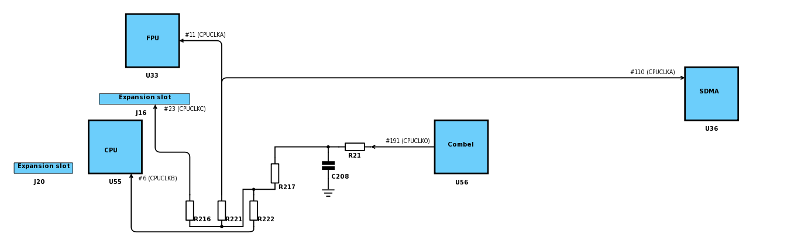

# Clock patch for Atari Falcon

This is a website trying to explain the clock patch for the Atari Falcon in layman's terms. As a bonus, you can find here [history of all known schematic and PCB revisions](history.md), with details of change (if available).

If you find an error, please mention it in the [issues](https://github.com/mikrosk/clockpatch/issues) or fork this repository and provide a [pull request](https://github.com/mikrosk/clockpatch/pulls) (you can edit these files directly in the web editor).

## What is it?

## Why does it exist?

The problematic part of the design is here:
 
 Here we can see that the main clock signal (16.042494 MHz) goes from the Combel (also known as the Combo IC :)) via **R21**, having **C208** (not present on PCB since rev.H) as a low pass filter and finally through **R217** (0 Ω) right into three resistors: **R216** (33 Ω), **R221** (33 Ω, changed to 0 Ω in PCB rev.H) and **R222** (33 Ω).

Atari didn't realise the problem until it was too late. As you can see in the [schematic / PCB history log](history.md), the first attempt to fix had appeared in August 1993, i.e. by the time when Atari would be shutting down Falcon manufacturing.

## How do I know I need it?

## How and where the mod is done?

### Variant 1.1
### Variant 1.2
### Variant 1.3
### Variant 1.4
### Variant 2.1
### Variant 2.2

## How do I know it worked?
