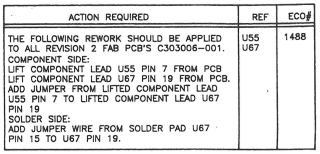
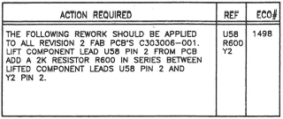
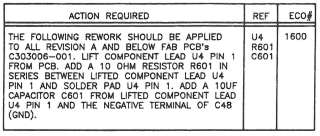
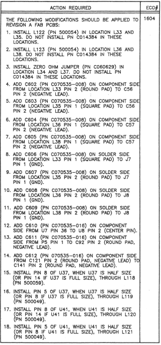
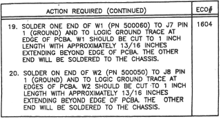
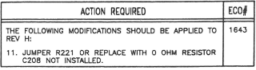
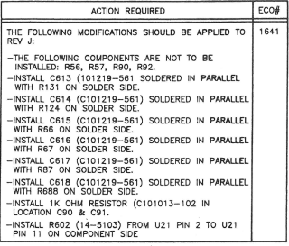

## Schematic / PCB history

The main PCB has following production numbers:

- **CA401332-001** ASSY PCB FALCON030 NTSC (US/CAN; Atari last revision: J)
- **CA401332-002** ASSY PCB FALCON030 PAL-I (GERMANY, generally most of Western Europe, Australia, and New Zealand; last Atari revision: H)
- **CA401332-003** ASSY PCB FALCON030 PAL-B (UK, generally UK, Ireland, Hong Kong, South Africa, and Macau; last Atari revision: H)
- **CA401332-004** ASSY PCB FALCON030 PERITEL (FRANCE; last Atari revision: A)

Schematic C303007-001 rev. | Schematic rev. date | PCB rev. | PCB approval date | Description | PCB rev. changes | Notes
-------------------------- | ------------------- | -------- | ----------------- | ----------- | ---------------- | -----
A	| 23/07/1992 ||| Initial release
B	|	25/08/1992 ||| Revised per ECO #1488 
C	|	25/08/1992 ||| Revised per ECO #1492
D	|	25/08/1992 ||| Revised per ECO #1497
E	|	|||			Revised per ECO #1498 
F	|	10/09/1992 | A || Revised per ECO #1505	| NTSC A, PAL-I/B A, PERITEL A | Production release, manufactured in 10/1992 by ATMC's "Golden Horse" (PAL) and "ECS Tamsui" (NTSC, PERITEL); PERITEL models had socketed CODEC and no RF modulator
G	|	06/01/1993 | B | 26/01/1993 |	Revised per ECO #1600  || Manufactured by EFA's Ta Yuan ever since; there's no PERITEL version manufactured anymore
H	|	20/01/1993 | C | 16/03/1993 |	Revised per ECO #1604  
||| D | 16/03/1993 | Revised per ECO #1613 || Common D/C release, manufactured for Atari between 03/1993 - 09/1993, later sold by C-Lab as MKI models
||| E |	02/03/1993 | Revised per ECO #1621
||| F | 30/04/1993 | Revised per [ECO #1625](Eco1625.pdf) || Corrected error made on ECO #1604
J	|	11/06/1993 | G | 04/08/1993 | Revised per [ECO #1642](Eco1642.pdf) | NTSC G | Improved video quality for NTSC machines
K	|	06/08/1993 | H | 04/08/1993 | Revised per [ECO #1643](Eco1643.pdf)  |	NTSC H, PAL-I/B G	| Attempt to fix sound crackle during DMA playback
L	|	06/08/1993 | J | 04/08/1993 | Revised per ECO #1641  | NTSC J, PAL-I/B H
||||||	PAL J
|||||| PAL K |	C-Lab Falcon MKII, manufactured in 09/1994

Schematic 500047-001 rev. | Schematic rev. date	| Description | Notes
------------------------- | -------------------	| ----------- | -----
1	|	06/01/1993 ||Initial release (spin-off from rev.G?)
A	|	01/03/1993 || Engineering release
B	|	13/05/1993 | Revised per ECO #1644 | Production release
